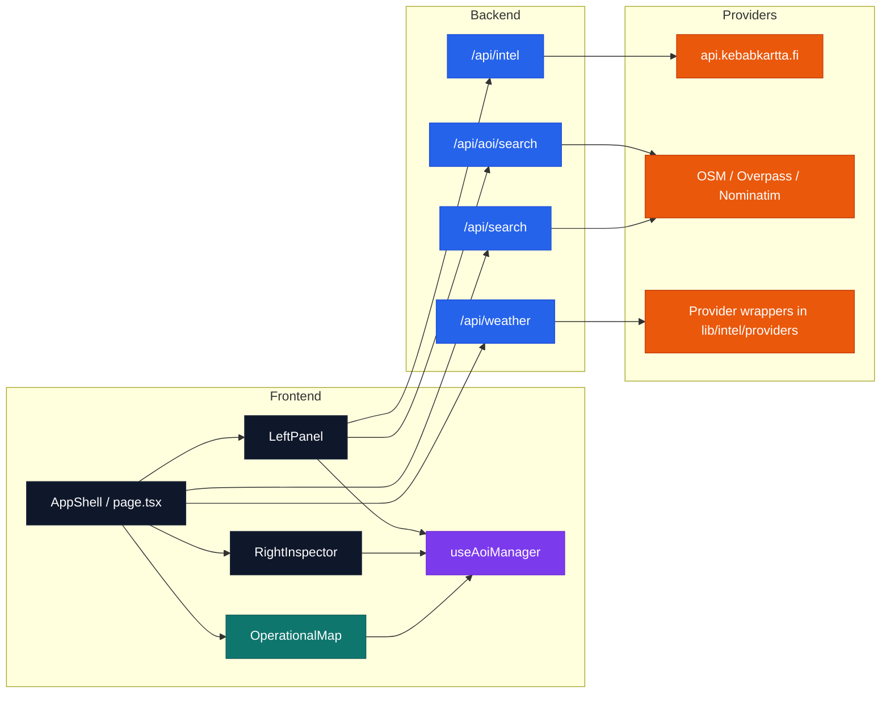

# Sightline

Sightline is a geospatial intelligence workspace built with Next.js, TypeScript, MapLibre GL JS, and Terra Draw.

The application is designed around a document-editor-style workflow:

- the map is the central working canvas
- users define one or more Areas of Interest as `Sections`
- each Section maintains its own notes, geometry, filters, and fetched intelligence
- intelligence is fetched through backend API routes and rendered back onto the selected Section

This repository currently focuses on frontend-heavy spatial analysis workflows backed by a custom intelligence API layer.


## What Sightline Does

Sightline combines three main capabilities:

1. Section-based map analysis
   Users can draw, save, select, rename, and delete multiple AOIs directly on the map.

2. Per-section intelligence workflows
   Each Section stores its own chosen data sources and fetched intelligence state independently from other Sections.

3. Multi-source geospatial overlays
   Intelligence is aggregated through `/api/intel`, normalized as GeoJSON, clipped to the selected AOI, and rendered on the map.

In practice, this means one Section can focus on weather and terrain while another focuses on bridges, telecom, and logistics without those states bleeding into each other.

## Current Product Model

The current frontend revolves around these concepts:

### Sections

A Section is a drawn AOI plus lightweight project metadata:

- `id`
- `name`
- `notes`
- `geometry`
- `bounds`
- `selectedFilters`
- timestamps
- in-memory intelligence state

Sections appear in the left panel and are rendered on the map simultaneously.

### Intelligence

When the user clicks `Fetch Intelligence`, the selected Section is sent to:

```http
POST /api/intel
```

The payload includes:

- AOI geometry
- AOI bbox
- selected data-source filters

The response is normalized into GeoJSON, filtered client-side so only features inside or intersecting the AOI remain, and then rendered immediately for the selected Section.

### Workspace Layout

The UI is structured like a document editor:

- top toolbar
- left panel for Sections and data-source controls
- center map canvas
- right inspector for Section notes, metadata, and intelligence status

## Core Features

### AOI authoring

The app supports map-based AOI creation using Terra Draw:

- polygon
- rectangle
- circle
- freehand
- select/edit

### Base maps

The MapLibre canvas supports multiple basemaps:

- Streets / Standard
- Terrain
- Satellite
- MML / National Land Survey raster
- Dark / Tactical placeholder

### Section-scoped intelligence

Each Section has isolated filter state. Supported frontend filter categories are:

- `terrain`
- `weather`
- `infrastructure`
- `roads`
- `bridges`
- `population`
- `telecom`
- `satellite`
- `healthcare`
- `power`
- `water`
- `logistics`

### AOI-aware clipping

Fetched intelligence is clipped on the client before display:

- `Point` features must be inside the selected AOI
- `LineString`, `MultiLineString`, `Polygon`, and `MultiPolygon` features must intersect the selected AOI

This is implemented with Turf.

### Persistence model

Only lightweight Section metadata is persisted to `localStorage`.

Persisted:

- id
- name
- notes
- comments
- geometry
- bounds
- center
- selected filters
- timestamps

Not persisted:

- fetched GeoJSON intelligence
- loading state
- temporary map overlays
- weather/terrain/intel responses

That keeps local storage small and avoids quota errors.

## Technical Architecture



## Important Files

These are the main entrypoints and modules worth understanding first.

### Frontend shell

- [app/page.tsx](app/page.tsx)
  Main client page that coordinates Section state, fetch actions, and map/inspector layout.

- [components/layout/AppShell.tsx](components/layout/AppShell.tsx)
  The document-style page frame.

- [components/layout/LeftPanel.tsx](components/layout/LeftPanel.tsx)
  Sections list, data-source filters, fetch action, and AOI search UI.

- [components/layout/RightInspector.tsx](components/layout/RightInspector.tsx)
  Selected Section notes and intelligence summary.

- [components/layout/TopToolbar.tsx](components/layout/TopToolbar.tsx)
  Toolbar for file actions, drawing tools, and basemap switching.

### Map + drawing

- [components/map/OperationalMap.tsx](components/map/OperationalMap.tsx)
  MapLibre map, Terra Draw integration, AOI rendering, intelligence overlays, and popups.

### AOI / Section state

- [hooks/useAoiManager.ts](hooks/useAoiManager.ts)
  Central React hook for Section state, selection, filters, persistence, and in-memory intelligence state.

- [lib/aoi/types.ts](lib/aoi/types.ts)
  Section, AOI, persistence, and intel state types.

- [lib/aoi/utils.ts](lib/aoi/utils.ts)
  AOI geometry normalization, area calculation, bounds, and creation helpers.

- [lib/aoi/persistence.ts](lib/aoi/persistence.ts)
  Lightweight persisted Section conversion.

- [lib/aoi/storage.ts](lib/aoi/storage.ts)
  Local storage read/write helpers.

### Intelligence pipeline

- [lib/intel/client.ts](lib/intel/client.ts)
  Frontend fetch client for `/api/intel`.

- [lib/intel/normalizeFeatureProperties.ts](lib/intel/normalizeFeatureProperties.ts)
  Defensive normalization for frontend intelligence features.

- [lib/geo/filterFeaturesToAoi.ts](lib/geo/filterFeaturesToAoi.ts)
  Turf-based AOI clipping.

- [app/api/intel/route.ts](app/api/intel/route.ts)
  Backend intelligence aggregator route.

### Search and weather

- [app/api/search/route.ts](app/api/search/route.ts)
  General search route.

- [app/api/aoi/search/route.ts](app/api/aoi/search/route.ts)
  AOI-scoped OSM search route.

- [app/api/weather/route.ts](app/api/weather/route.ts)
  Weather fallback route.

## Data Sources and Integrations

The frontend is intentionally decoupled from individual providers. It sends AOI geometry, bbox, and selected filters to `/api/intel`; the backend decides which providers to call.

### Intelligence providers

The repository contains provider and source-adapter modules under:

- `lib/intel/providers/*`
- `lib/intel/sources/*`

Examples include:

- FMI
- Maanmittauslaitos
- OpenCellID
- Väylä
- satellite and telecom-related integrations

### Backend geospatial API

The custom backend API documented in [API.md](API.md) is currently central to the intelligence pipeline.

It includes endpoints for:

- raster/vector tiles
- bbox feature queries
- terrain data
- weather observations and forecasts
- logistics and chokepoints
- bridges
- population intelligence
- communications / telecom intelligence
- satellite pass information

## Running the Project

### Requirements

- Node.js 20+ recommended
- npm

### Install

```bash
npm install
```

### Development

```bash
npm run dev
```

Then open:

```text
http://localhost:3000
```

### Lint

```bash
npm run lint
```

### Type check

```bash
npx tsc --noEmit
```

### Production build

```bash
npm run build
```

Note: in sandboxed environments, `next build` may fail because Turbopack attempts to create a process or bind to a port. In a normal local environment, build should be run outside that restriction.

## How the Frontend Works

### 1. Create Sections

Users draw AOIs on the map. Each drawing becomes a Section and appears in the left panel.

### 2. Configure per-section filters

Selecting a Section reveals its own `Data Sources` checkboxes. These filters do not affect any other Section.

### 3. Fetch intelligence

The selected Section is posted to `/api/intel`. The frontend:

1. receives GeoJSON or overlay-like intel data
2. normalizes feature properties
3. clips the result to the selected AOI
4. stores the result in the selected Section’s in-memory state
5. pushes the data into MapLibre immediately

### 4. Review output

The selected Section’s overlays are rendered on the map, and the right inspector shows:

- notes
- metadata
- fetch status
- fetched timestamp
- grouped intelligence counts

## Current API Contracts

### `/api/intel`

Expected frontend request:

```json
{
  "aoiId": "aoi-123",
  "geometry": {
    "type": "Polygon",
    "coordinates": [[[24.8, 60.1], [25.1, 60.1], [25.1, 60.3], [24.8, 60.3], [24.8, 60.1]]]
  },
  "bbox": [24.8, 60.1, 25.1, 60.3],
  "filters": ["weather", "terrain", "bridges"]
}
```

Current frontend accepts either:

- a raw GeoJSON `FeatureCollection`
- or the repository’s aggregated overlay response shape from `/api/intel`

### `/api/aoi/search`

Expected request:

```json
{
  "aoiId": "aoi-123",
  "query": "museums",
  "bbox": [24.8, 60.1, 25.1, 60.3],
  "geometry": {
    "type": "Polygon",
    "coordinates": [[[24.8, 60.1], [25.1, 60.1], [25.1, 60.3], [24.8, 60.3], [24.8, 60.1]]]
  }
}
```

## Persistence and State Rules

### Persisted

- Section geometry and metadata
- Section notes
- selected filters
- timestamps

### Runtime only

- fetched intelligence
- loading / error fetch state
- current map overlays
- weather overlay results
- selection-focused UI state

This split is deliberate. It keeps the app resilient, small in storage, and safe from `QuotaExceededError`.

## Known Constraints

- Intelligence rendering is Section-scoped by default; only the selected Section’s intelligence is shown.
- Some backend routes still depend on external provider quality and upstream coverage.
- The project currently favors runtime normalization and defensive filtering over strict provider-specific schemas in the frontend.
- There are legacy files in the repository from earlier UI generations; the active map workspace is centered around `OperationalMap`, `LeftPanel`, `RightInspector`, and `useAoiManager`.

## Suggested Reading Order

If you are onboarding to the codebase, start here:

1. [app/page.tsx](app/page.tsx)
2. [hooks/useAoiManager.ts](hooks/useAoiManager.ts)
3. [components/map/OperationalMap.tsx](components/map/OperationalMap.tsx)
4. [app/api/intel/route.ts](app/api/intel/route.ts)
5. [API.md](API.md)

## License

MIT. See [LICENSE](LICENSE).
